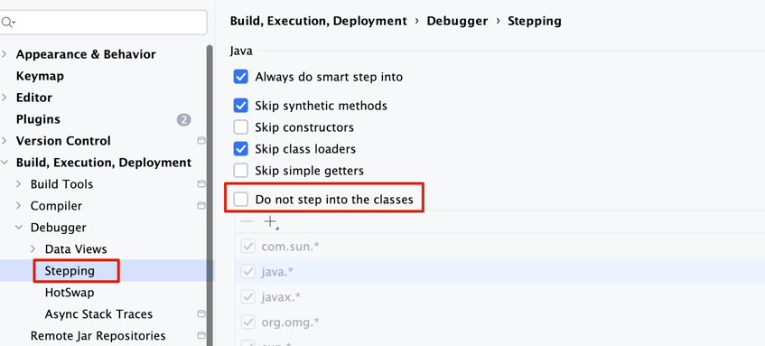
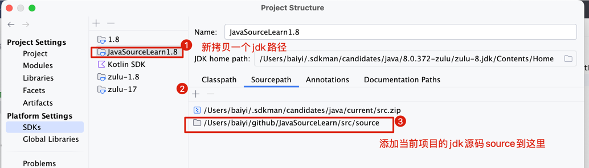
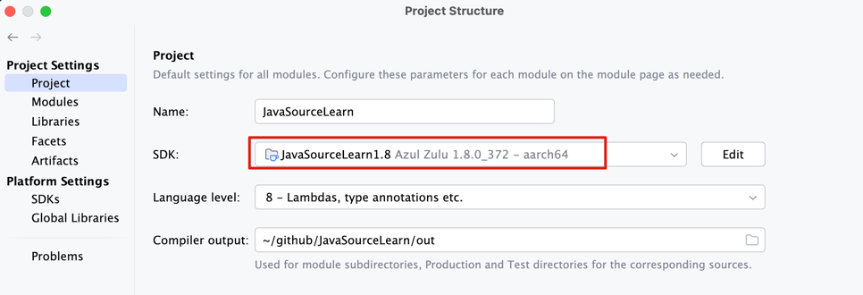

## 环境准备
1. 点击 Build,Execution,Deployment --> Compiler --> Shard build process heap size(Mbytes) 修改为 1700

2. 点击 Build,Execution,Deployment --> Compiler --> Debugger --> Stepping --> 去除勾选 Do not step into the classes：作用是为了能 debug 到 JDK 源码。

3. 点击 Project Structure --> SDKS 

4. 选择刚刚创建的 sdk，点击 Project Structure --> Project

5. 运行 HashMapTest.java，即可查看是否编译成功
